[← Back to README](../README.md)

# Architecture

## System design

ClearPort is a single Next.js application — one deployable, three logical tiers:

- **Presentation** — App Router pages (`app/`), rendered mostly as server components that read Supabase directly server-side
- **Application logic** — API routes (`app/api/`) and the pipeline modules (`lib/pipeline/`)
- **Data** — Supabase: Postgres for structured records, a private Storage bucket for source documents

Keeping this as one Next.js project rather than a separate backend service was a deliberate choice: the entire pipeline is TypeScript end to end, sharing types between the UI and the processing logic, with no network boundary (and no CORS) between the layers that call each other. The trade-off, made consciously, is that UI and API logic share one process — acceptable for this system's scale.

## Diagram

```mermaid
flowchart TD

subgraph group_intake["Email Intake"]
  node_dataset_sources["Dataset Sources"]
  node_live_handler["Live Email Handler<br/>[route.ts]"]
  node_dataset_ingestor["Dataset Ingestor<br/>[dataset.ts]"]
end

subgraph group_processing["Document Processing"]
  node_classifier["Email Classifier<br/>[classify.ts]"]
  node_document_parsers["Document Parsers<br/>[index.ts]"]
  node_comparison_pipeline["Comparison Pipeline<br/>[compare.ts]"]
  node_normalization["Field Normalization<br/>[normalize.ts]"]
end

subgraph group_evidence["Evidence Storage"]
  node_supabase_store["Supabase Ingest Store<br/>[supabase-store.ts]"]
  node_supabase_db[("Supabase Database")]
  node_document_storage[("Document Storage<br/>[admin.ts]")]
end

subgraph group_workspace["Operations Workspace"]
  node_server_data["Server Data Access<br/>[server-data.ts]"]
  node_board["Operations Board<br/>[page.tsx]"]
  node_inbox_ui["Verification Inbox<br/>[page.tsx]"]
  node_report_ui["Evidence Report<br/>[page.tsx]"]
  node_review_ui["Review Queue<br/>[page.tsx]"]
  node_review_api["Review API<br/>[route.ts]"]
  node_insights_ui["Operations Insights<br/>[page.tsx]"]
  node_admin_export["Admin Export<br/>[page.tsx]"]
  node_export_api["Submission Export<br/>[route.ts]"]
end

subgraph group_integrations["External Services"]
  node_gemini["Gemini Fallback"]
end

node_operations_user(("Operations User"))
node_live_sender(("Live Email Sender"))
node_dataset_operator(("Dataset Operator"))

node_live_sender -->|"posts email"| node_live_handler
node_live_handler -->|"classifies"| node_classifier
node_live_handler -->|"upserts email"| node_supabase_db
node_live_handler -->|"uploads files"| node_document_storage
node_live_handler -->|"logs receipt"| node_supabase_db
node_dataset_operator -->|"runs ingest"| node_dataset_ingestor
node_dataset_sources -->|"reads files"| node_dataset_ingestor
node_dataset_ingestor -->|"persists ingest"| node_supabase_store
node_supabase_store -->|"writes records"| node_supabase_db
node_supabase_store -->|"uploads documents"| node_document_storage
node_classifier -.->|"falls back"| node_gemini
node_comparison_pipeline -->|"reads documents"| node_document_storage
node_comparison_pipeline -->|"extracts text"| node_document_parsers
node_comparison_pipeline -->|"normalizes fields"| node_normalization
node_comparison_pipeline -->|"writes results"| node_supabase_db
node_operations_user -->|"opens board"| node_board
node_operations_user -->|"opens inbox"| node_inbox_ui
node_operations_user -->|"opens report"| node_report_ui
node_operations_user -->|"reviews cases"| node_review_ui
node_operations_user -->|"views insights"| node_insights_ui
node_operations_user -->|"opens admin"| node_admin_export
node_board -->|"loads rows"| node_server_data
node_inbox_ui -->|"loads rows"| node_server_data
node_report_ui -->|"loads evidence"| node_server_data
node_insights_ui -->|"loads metrics"| node_server_data
node_server_data -->|"reads data"| node_supabase_db
node_review_ui -->|"confirms case"| node_review_api
node_review_api -->|"updates review"| node_supabase_db
node_review_api -->|"logs review"| node_supabase_db
node_admin_export -->|"downloads export"| node_export_api
node_export_api -->|"reads results"| node_supabase_db

click node_dataset_sources "https://github.com/yo-vic/ms-sdoc-verifier/tree/main/inbox"
click node_live_handler "https://github.com/yo-vic/ms-sdoc-verifier/blob/main/app/api/inbound-email/route.ts"
click node_dataset_ingestor "https://github.com/yo-vic/ms-sdoc-verifier/blob/main/lib/ingest/dataset.ts"
click node_classifier "https://github.com/yo-vic/ms-sdoc-verifier/blob/main/lib/pipeline/classify.ts"
click node_document_parsers "https://github.com/yo-vic/ms-sdoc-verifier/blob/main/lib/pipeline/parsers/index.ts"
click node_comparison_pipeline "https://github.com/yo-vic/ms-sdoc-verifier/blob/main/lib/pipeline/compare.ts"
click node_normalization "https://github.com/yo-vic/ms-sdoc-verifier/blob/main/lib/pipeline/normalize.ts"
click node_supabase_store "https://github.com/yo-vic/ms-sdoc-verifier/blob/main/lib/ingest/supabase-store.ts"
click node_supabase_db "https://github.com/yo-vic/ms-sdoc-verifier/blob/main/supabase/migrations/202609190001_clearport.sql"
click node_document_storage "https://github.com/yo-vic/ms-sdoc-verifier/blob/main/lib/supabase/admin.ts"
click node_server_data "https://github.com/yo-vic/ms-sdoc-verifier/blob/main/lib/server-data.ts"
click node_board "https://github.com/yo-vic/ms-sdoc-verifier/blob/main/app/page.tsx"
click node_inbox_ui "https://github.com/yo-vic/ms-sdoc-verifier/blob/main/app/inbox/page.tsx"
click node_report_ui "https://github.com/yo-vic/ms-sdoc-verifier/blob/main/app/report/%5BemailId%5D/page.tsx"
click node_review_ui "https://github.com/yo-vic/ms-sdoc-verifier/blob/main/app/review/page.tsx"
click node_review_api "https://github.com/yo-vic/ms-sdoc-verifier/blob/main/app/api/review/route.ts"
click node_insights_ui "https://github.com/yo-vic/ms-sdoc-verifier/blob/main/app/insights/page.tsx"
click node_admin_export "https://github.com/yo-vic/ms-sdoc-verifier/blob/main/app/admin/page.tsx"
click node_export_api "https://github.com/yo-vic/ms-sdoc-verifier/blob/main/app/api/export/submission/route.ts"

classDef toneNeutral fill:#f8fafc,stroke:#334155,stroke-width:1.5px,color:#0f172a
classDef toneBlue fill:#dbeafe,stroke:#2563eb,stroke-width:1.5px,color:#172554
classDef toneAmber fill:#fef3c7,stroke:#d97706,stroke-width:1.5px,color:#78350f
classDef toneMint fill:#dcfce7,stroke:#16a34a,stroke-width:1.5px,color:#14532d
classDef toneRose fill:#ffe4e6,stroke:#e11d48,stroke-width:1.5px,color:#881337
classDef toneIndigo fill:#e0e7ff,stroke:#4f46e5,stroke-width:1.5px,color:#312e81
classDef toneTeal fill:#ccfbf1,stroke:#0f766e,stroke-width:1.5px,color:#134e4a
class node_dataset_sources,node_live_handler,node_dataset_ingestor,node_operations_user toneBlue
class node_classifier,node_document_parsers,node_comparison_pipeline,node_normalization toneAmber
class node_supabase_store,node_supabase_db,node_document_storage toneMint
class node_server_data,node_board,node_inbox_ui,node_report_ui,node_review_ui,node_review_api,node_insights_ui,node_admin_export,node_export_api toneRose
class node_gemini,node_live_sender,node_dataset_operator toneIndigo
```



## Data flow

**Dataset path** (used to populate and demonstrate the system against the provided dataset):
```
inbox/ + attachments/ (local)
→ npm run seed → Supabase (emails, attachments, Storage)
→ npm run classify → emails.category (rule-first, Gemini fallback)
→ npm run compare → extracted_fields, comparisons
→ Next.js pages read Supabase directly
```

**Live path** (for a real inbound email, via `/api/inbound-email`):
```
Email webhook → POST /api/inbound-email
→ classify() (same logic as the batch pipeline)
→ Supabase emails row + Storage upload + attachments row
→ audit_log entry
```

## Data model

Five tables in `supabase/migrations/202609190001_clearport.sql`:

| Table | Holds |
|---|---|
| `emails` | Content, source (`dataset`/`live_inbox`), classification + confidence |
| `attachments` | Filenames, detected doc type, Storage path, content hash, ingest state |
| `extracted_fields` | Per-field extracted value, normalized value, and evidence (snippet + line number) |
| `comparisons` | Final status, review reason, mismatched fields, human review state |
| `audit_log` | Every system and human action, for a defensible decision trail |

## Security

- **Row Level Security is enabled on every table.** No anonymous browser access exists yet — only the server-side admin client (using the Supabase service-role key) can read or write.
- **The service-role key never reaches the browser.** It's used only in server components, API routes, and local scripts — never given a `NEXT_PUBLIC_` prefix. The browser-safe publishable key and anon key are the only Supabase credentials exposed client-side.
- **Every automated and human decision is audited** via `audit_log` — classification results, comparison outcomes, and human review confirmations are all recorded with an actor (`system`/`human`) and a timestamp.
- **Gemini calls are rate-limited** (paced under the free tier's 15 requests/minute) with retry/backoff on transient failures, so a temporary rate limit can't silently misclassify an email as `GENERAL`.